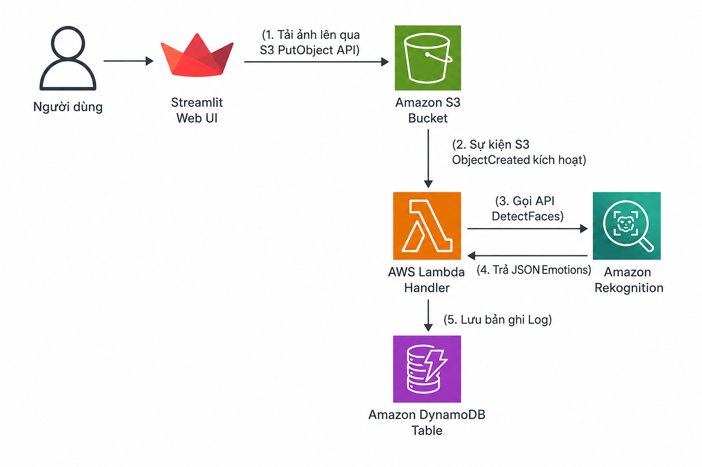

Here is the complete, professionally translated English version of your Project Proposal, formatted in clean Markdown so you can copy and paste it directly into your `.md` file.

---

# FINAL PROJECT PROPOSAL

**Topic:** Serverless Facial Emotion Recognition Analytics Platform

**Major:** Information Technology

**Proposer:** Le Quoc Nam

---

## 1. EXECUTIVE SUMMARY

The **"Serverless Facial Emotion Recognition Analytics Platform"** project is an image-based facial emotion analysis system built on Amazon Web Services (AWS) Serverless architecture. The platform allows end-users to upload portrait images through an intuitive Web interface. This action automatically triggers an event-driven data processing pipeline on the backend to recognize facial emotions and write analysis logs.

The core technologies integrated into the project include:

* **User Interface (Frontend):** A minimal, flexible Streamlit (Python) application running locally or on a virtual machine.
* **Object Storage:** **Amazon S3** responsible for securely storing input image files.
* **Serverless Compute:** **AWS Lambda** (Python 3.12 using the AWS SDK `boto3`) acting as the orchestrator for business logic processing.
* **Artificial Intelligence (AI/ML Service):** **Amazon Rekognition** (using the `DetectFaces` API) serving as the computer vision engine to detect faces and extract emotion metrics.
* **Database:** **Amazon DynamoDB** (NoSQL table) storing final analysis logs with optimized execution time.

**Solution Highlights:** Automatic auto-scaling from zero to thousands of concurrent requests without infrastructure management, operation at near-zero cost (leveraging the AWS Free Tier), and a clean, modular, highly maintainable codebase.

---

## 2. PROBLEM STATEMENT

### Real-World Context:

In the digital age, understanding human emotion is critical for enhancing Customer Experience (CX) in retail and service industries, as well as measuring student engagement in online education (E-learning). However, traditional methods such as manual surveys often suffer from low response rates, high time consumption, and significant subjectivity.

### Technical Challenges:

Building an AI/ML-driven image analysis system using traditional methods presents major hurdles:

1. **High Infrastructure Costs:** Requires powerful GPU-backed virtual servers (e.g., Amazon EC2) to run Deep Learning models. These servers must run 24/7, incurring substantial idle costs during off-peak hours.
2. **Operational Overhead:** System administrators must continuously configure operating systems, apply security patches, set up Load Balancers, and manage complex Auto Scaling Groups.
3. **Latency and Overload:** Traditional systems are prone to bottlenecks and outages during sudden traffic spikes.

### Proposed Solution:

This project addresses these challenges by shifting to a **Serverless architecture** combined with **Managed AI Services** on AWS. This approach completely eliminates physical or virtual server management, scales instantly based on real-time demand, and operates strictly on a pay-as-you-go model.

---

## 3. SOLUTION ARCHITECTURE

The system is designed following an Event-Driven Architecture with a closed-loop sequential data flow:



### Detailed AWS Service Roles in the System:

* **Amazon S3 (`my-facial-emotion-recognition-2026`):** Stores JPG/PNG image files uploaded from the Frontend. It acts as a durable, secure object store (blocking public access by default).
* **AWS Lambda (`FaceEmotionRecognizer`):** Functions as the central "brain" of the backend. Lambda is automatically invoked by an S3 Event Trigger. Upon execution, Lambda reads the event metadata to identify the exact bucket and key, coordinates the call to Rekognition, and persists results into DynamoDB.
* **Amazon Rekognition:** Analyzes the input image from S3, detects faces, and returns an array of facial attributes, including emotion categories (HAPPY, SAD, ANGRY, CONFUSED, etc.) with their corresponding confidence scores.
* **Amazon DynamoDB (`FaceEmotionLogs`):** A NoSQL database storing analysis log records. Each item consists of:
* `LogID` (Partition Key - String): A random UUID uniquely identifying the record.
* `Timestamp` (String): Execution timestamp in ISO-8601 UTC format.
* `ImageName` (String): Original image filename.
* `FaceCount` (Number): Total number of detected faces in the image.
* `TopEmotion` (String): Dominant emotion with the highest confidence level.
* `Confidence` (String): Confidence percentage score of the dominant emotion.


* **AWS CloudWatch Logs:** Captures all execution logs from Lambda for monitoring and debugging purposes.

---

## 4. TECHNICAL IMPLEMENTATION

The technical execution of the project is broken down into three main phases:

### Phase A: Infrastructure Setup & IAM Security Configuration (Security First)

* **Storage:** Create the S3 bucket with default SSE-S3 encryption enabled and block all public access.
* **Database:** Initialize the DynamoDB table with `LogID` as the Primary Key. Set the Capacity Mode to **On-Demand** to charge only for actual read/write requests.
* **Least Privilege IAM Configuration:**
* Create an IAM User named `streamlit-s3-uploader` dedicated to the Client Frontend, attached only with a policy granting `s3:PutObject` permission restricted to the target bucket.
* Create an IAM Execution Role named `LambdaEmotionRecognitionRole` for AWS Lambda, granting minimal required permissions: reading from S3 (`s3:GetObject`), calling face analysis APIs (`rekognition:DetectFaces`), and writing logs (`dynamodb:PutItem`).


### Phase B: Backend Development (AWS Lambda)

* Utilize **Python 3.12** with the AWS SDK (`boto3`).
* Decouple the Lambda codebase into single-purpose modular files for better testability and maintainability:
* `rekognition_service.py`: Contains functions that interact directly with Amazon Rekognition and helper algorithms to determine the dominant emotion (`get_dominant_emotion`).
* `dynamodb_service.py`: Initializes the database client and handles item insertion into DynamoDB.
* `lambda_function.py`: The main entry point (handler) coordinating services and managing error handling gracefully (`try...except`).


* Package these modules into a deployment ZIP file and upload to the AWS Lambda Console.

### Phase C: Frontend Development (Streamlit)

* Build a local interactive web interface using **Streamlit**.
* Apply modular code design for local execution:
* `config.py`: Loads environment variables and API credentials securely from a hidden `.env` file using `python-dotenv`.
* `validation.py`: Validates file extensions (.jpg, .png) and enforces a maximum upload size limit of 5MB to optimize network bandwidth.
* `s3_service.py`: Initializes an S3 client using the restricted IAM user credentials to perform file uploads.
* `ui_components.py`: Renders the user interface layout, displays image previews via the Pillow library, and presents analysis results.
* `app.py`: Entry point to start the Streamlit application.


---

## 5. ROADMAP AND MILESTONES

The project timeline spans exactly **2 months (8 weeks)**, structured as follows:

```
[Month 1: Learning & Architecture Design] ────> [Month 2: Implementation & Evaluation]
  ├─ Week 1: AWS Fundamentals                     ├─ Week 5: Lambda Backend Coding
  ├─ Week 2: Storage & Databases                  ├─ Week 6: S3 Triggers & CloudWatch Setup
  ├─ Week 3: Serverless & AI/ML Services          ├─ Week 7: Streamlit UI Integration & E2E Testing
  └─ Week 4: S3 & DynamoDB Infrastructure Setup   └─ Week 8: Reporting, Clean-up & Final Defense

```

### Key Milestones:

* **Milestone 1 (End of Week 3):** Finalize the system architecture diagram and receive project topic approval from the mentor.
* **Milestone 2 (End of Week 4):** Complete setup for storage (S3), database (DynamoDB), and proper IAM access control configurations.
* **Milestone 3 (End of Week 6):** Complete backend Lambda implementation, configure S3 Event Triggers for automated processing, and verify logging into DynamoDB.
* **Milestone 4 (End of Week 7):** Connect the Streamlit frontend with AWS resources and complete End-to-End (E2E) integration testing.
* **Milestone 5 (End of Week 8):** Submit the technical final report, perform resource clean-up to avoid stray charges, and defend the project.

---

## 6. BUDGET ESTIMATE

The project cost is fully optimized by maximizing the **AWS Free Tier** benefits available for new accounts during the first 12 months.

### Estimated Monthly Cost Analysis (~1,000 images processed/month):

| AWS Service | Cost Basis | Free Tier Allowance | Estimated Cost/Month |
| --- | --- | --- | --- |
| **Amazon S3** | Storage capacity & PUT/GET requests | 5 GB standard storage & 2,000 PUT requests/month | **$0.00 USD** |
| **AWS Lambda** | Request count & Compute duration (GB-seconds) | 1,000,000 requests & 400,000 GB-seconds/month | **$0.00 USD** |
| **Amazon Rekognition** | Images processed | 5,000 images analyzed/month | **$0.00 USD** |
| **Amazon DynamoDB** | Storage capacity & Read/Write units | 25 GB storage & On-Demand request capacity | **~$0.00 USD** |
| **CloudWatch Logs** | Ingested and stored log volume | 5 GB log data/month | **$0.00 USD** |
| **Total Estimated Cost** |  |  | **$0.00 USD** |

*Note:* Even after the Free Tier expires, recurring maintenance costs for running this architecture remain extremely negligible (a few cents per month for static S3 and DynamoDB storage) since there are no idle server costs.

---

## 7. RISK ASSESSMENT AND MITIGATION

| # | Identified Risk | Severity | Mitigation Strategy |
| --- | --- | --- | --- |
| 1 | **Leakage of AWS Credentials** (Access/Secret Keys) on public platforms like GitHub. | High | Never hardcode credentials into source code. Store credentials in `.env` files and include them in `.gitignore`. Use short-lived IAM Roles for cloud environments instead of static access keys. |
| 2 | **Large file uploads** causing bandwidth bottlenecks and extended Lambda execution timeouts. | Medium | Implement validation checks on the Streamlit Frontend to limit maximum file sizes to 5MB and accept only `.jpg`, `.jpeg`, and `.png` extensions. |
| 3 | **Infinite loop triggers** incurring high costs if Lambda saves processed images back into the S3 trigger source path. | High | Restrict S3 Event Triggers to a specific prefix like `uploads/`. Do not allow Lambda functions to write outputs back into this monitored directory. |
| 4 | **Access Denied errors** during system execution due to misconfigured permissions. | Low | Inspect AWS CloudWatch logs and S3 access logs to identify target Resource ARNs, then update Bucket Policies or IAM Policies accordingly. |

---

## 8. EXPECTED OUTCOMES

### Academic and Technical Growth:

* Master Event-Driven Programming concepts within modern cloud environments.
* Gain hands-on experience deploying and integrating core AWS Serverless services including S3, Lambda, Rekognition, and DynamoDB.
* Acquire practical expertise in designing Least Privilege IAM security models according to industry standards.
* Develop skills in writing clean, modular Python code optimized for serverless execution.

### Practical Impact:

* Deliver a stable, low-latency facial emotion analysis platform ready for real-world automated customer feedback collection.
* Provide a comprehensive proof-of-concept demonstrating practical Cloud Computing competency following the completion of the AWS First Cloud Journey program.