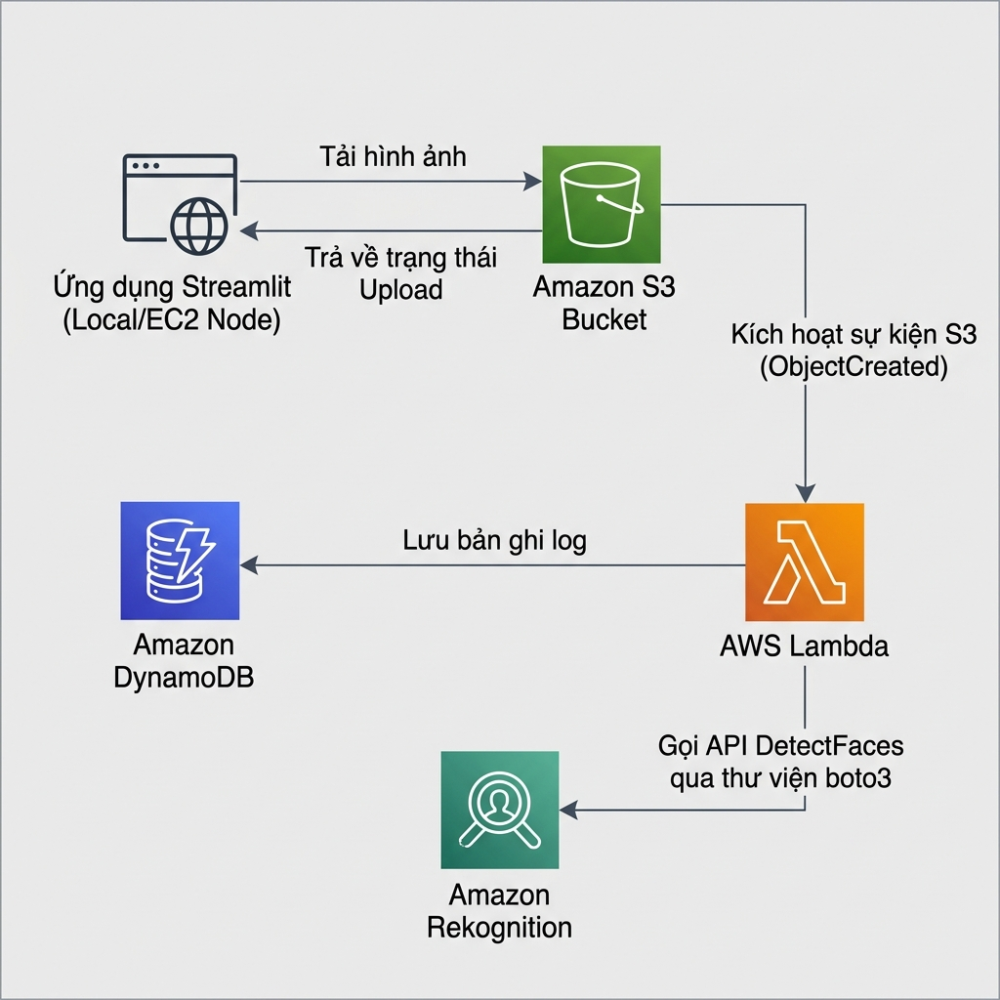

# 5.1. Workshop Overview

In this workshop, you will build and deploy a **Serverless Facial Emotion Recognition Analytics Platform**. This platform leverages AWS cloud services to create an automated, scalable, and low-cost pipeline that detects faces in uploaded images and logs identified emotions in a database.

---

## Objectives

By the end of this workshop, you will be able to:
- Build an interactive, user-friendly frontend interface using **Streamlit**.
- Securely store and organize image uploads in **Amazon S3**.
- Create an event-driven serverless workflow using **AWS Lambda**.
- Perform automated facial emotion analysis with **Amazon Rekognition** (using the `DetectFaces` API).
- Store processed analysis logs in a NoSQL database using **Amazon DynamoDB**.
- Perform automated cleanups of resources to avoid unintended AWS costs.

---

## System Architecture

The following diagram illustrates the system architecture and data processing flow:

### Data Flow Steps

1. **User Upload:** The user selects and uploads a portrait image (`.png`, `.jpg`, or `.jpeg`) via the Streamlit web application.
2. **S3 Storage:** The Streamlit app validates the file size and extension, then uses the AWS SDK for Python (`boto3`) to upload the image to a designated **Amazon S3** bucket.
3. **Lambda Execution:** The upload event triggers an **AWS Lambda** function automatically (via S3 Event Notification).
4. **Facial Analysis:** The Lambda function parses the event to extract the S3 bucket and object key, then calls **Amazon Rekognition** to detect faces and extract emotion metrics.
5. **NoSQL Logging:** The dominant emotion (highest confidence score) is identified, and the analysis metadata (including timestamp, image name, face count, and confidence rating) is saved to an **Amazon DynamoDB** log table.
