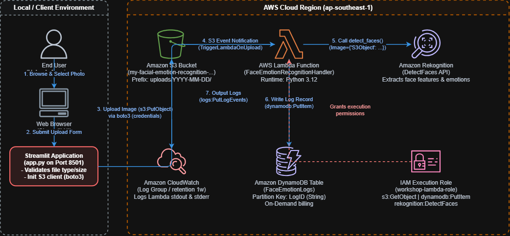

# 5.1. Tổng quan Workshop

Trong buổi thực hành (Workshop) này, bạn sẽ xây dựng và triển khai một **Nền tảng Phân tích Nhận diện Cảm xúc Khuôn mặt Serverless**. Nền tảng này tận dụng các dịch vụ đám mây của AWS để tạo ra một pipeline tự động, có khả năng mở rộng cao và chi phí thấp nhằm phát hiện khuôn mặt trong các ảnh tải lên và ghi nhận cảm xúc được xác định vào cơ sở dữ liệu.

---

## Mục tiêu học tập

Sau khi hoàn thành workshop này, bạn sẽ có thể:
- Xây dựng một giao diện người dùng tương tác, thân thiện bằng **Streamlit**.
- Lưu trữ và quản lý an toàn các tệp hình ảnh tải lên trong **Amazon S3**.
- Tạo luồng xử lý hướng sự kiện không máy chủ (event-driven serverless) sử dụng **AWS Lambda**.
- Thực hiện phân tích cảm xúc khuôn mặt tự động với **Amazon Rekognition** (thông qua API `DetectFaces`).
- Lưu trữ dữ liệu nhật ký phân tích vào cơ sở dữ liệu NoSQL sử dụng **Amazon DynamoDB**.
- Thực hiện dọn dẹp tài nguyên tự động để tránh phát sinh chi phí AWS ngoài ý muốn.

---

## Kiến trúc hệ thống

Sơ đồ dưới đây minh họa kiến trúc hệ thống và luồng xử lý dữ liệu:

### Chi tiết luồng xử lý dữ liệu

1. **Người dùng tải ảnh:** Người dùng chọn và tải lên một hình ảnh chân dung (`.png`, `.jpg`, hoặc `.jpeg`) thông qua ứng dụng web Streamlit.
2. **Lưu trữ S3:** Ứng dụng Streamlit xác thực kích thước và định dạng tệp, sau đó sử dụng thư viện AWS SDK cho Python (`boto3`) để tải ảnh lên một **Amazon S3** bucket được cấu hình trước.
3. **Kích hoạt Lambda:** Sự kiện tải ảnh lên S3 tự động kích hoạt một hàm **AWS Lambda** (thông qua tính năng S3 Event Notification).
4. **Phân tích khuôn mặt:** Hàm Lambda phân tích sự kiện để trích xuất tên bucket và key của ảnh, sau đó gọi dịch vụ **Amazon Rekognition** để phát hiện khuôn mặt và trích xuất các chỉ số cảm xúc.
5. **Ghi log vào cơ sở dữ liệu:** Cảm xúc chủ đạo (có độ tin cậy cao nhất) được xác định, và các siêu dữ liệu phân tích (bao gồm timestamp, tên ảnh, số lượng khuôn mặt và độ tin cậy) sẽ được lưu vào bảng log trong **Amazon DynamoDB**.
